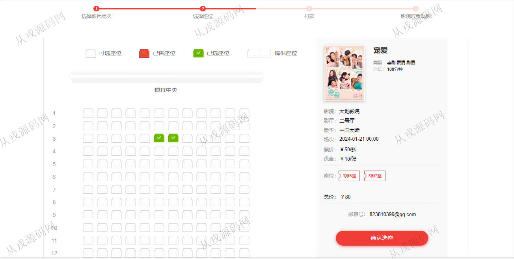
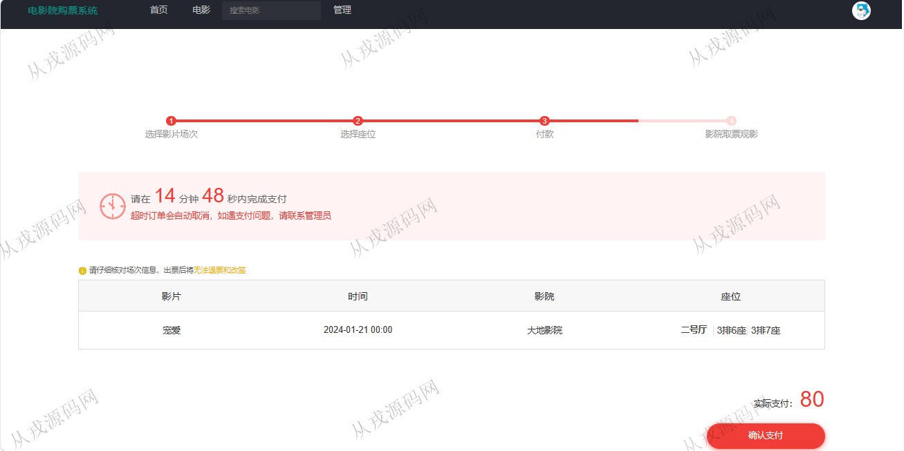
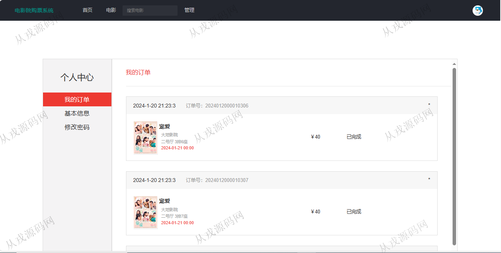
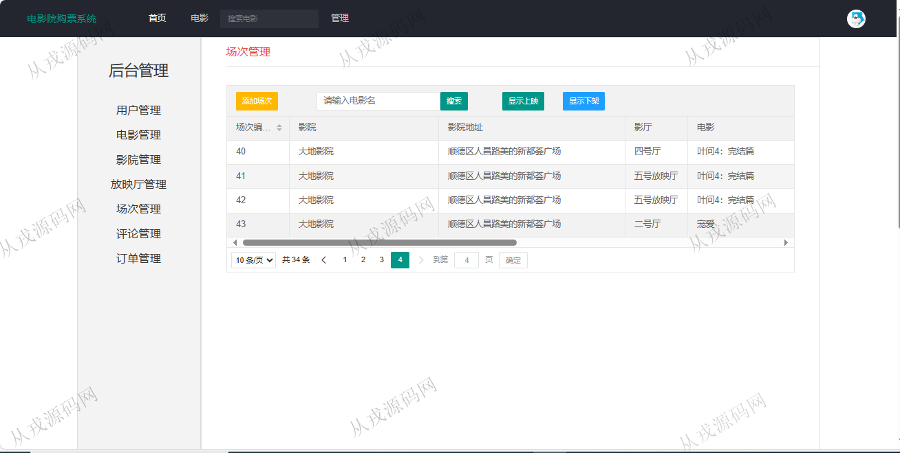

<h1 align="center">194.电影院购票管理系统</h1>

 获取sql文件 QQ: 386869957 QQ群: 377586148 

 [更多源码项目: 从戎源码网](https://armycodes.com/) 

## 简介

> 本代码来源于网络,仅供学习参考使用!
>
> 提供1.远程部署/2.修改代码/3.设计文档指导/4.框架代码讲解等服务
> 
> 用户端访问地址：http://localhost:8080/
> 
> 用户：user 123456
> 
> 管理后台访问地址：http://localhost:8080/jsp/manage/user.jsp
> 
> 管理员：admin 123456
>

## 项目介绍
基于java+jsp的电影院购票管理系统：前端 jsp、jquery，后端 servlet、jdbc；角色分为管理员、用户；集成电影选票、在线选座、付款、我的订单查询等功能于一体的系统。

## 功能介绍

### 用户

- 基本功能：登录，注册，退出
- 网站首页：主导航栏，轮播图，电影搜索，正在热映，评分排名
- 电影在线购票：电影分类导航展示，电影详情，评分，在线选座，在线支付（模拟）
- 个人中心：我的订单查询，个人基本信息，密码修改

### 管理员

- 用户管理：用户信息的增删改查，也可以由用户自行注册
- 电影管理：电影信息的增删改查，电影海报上传
- 影院管理：影院信息的增删改查
- 放映厅管理：放映厅信息的增删改查
- 场次管理：场次添加，列表查询，只有配置对应影片的场次，前台用户才可以购票下单
- 评论管理：查询用户评论信息，修改评论，删除评论
- 订单管理：查询用户的订单数据，订单状态显示

## 环境

- <b>IntelliJ IDEA 2021.3</b>

- <b>Mysql 5.7.26</b>

- <b>Tomcat 7.0.73</b>

- <b>JDK 1.8</b>

## 运行截图

